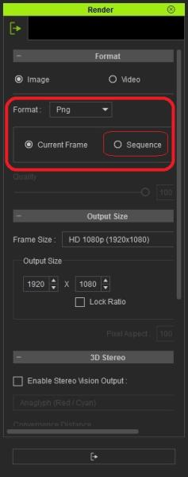

# 100.400 Image Sequence Export

See also "Image sequence export" at https://forum.reallusion.com/267321/Image-sequence-export

iClone allows you to export a sequence of images.

Look in the Render panel:

Format:
- [X] Image
- Video

Format: PNG

- Current Frame
- [X] Sequence

Output Size:

Frame Size: 

- HD 1080p (1920x1080)

See also "iClone 7 Export Transparant Background Video - Alpha Channel" at https://www.youtube.com/watch?v=VoPjVNebQEg

iClone 7 has a workaround for exporting video with a transparent background, also known as an alpha channel.  To export animation or other video with a transparent background in iClone, a image sequence can be made.  Once an image sequence is created, programs such as Adobe After Effects and Davinci Resolve can be used to transform the image sequence into a .MOV video file with a transparent background.  

This video walks through the steps to create a clean transparent background image sequence in iClone 7 or iClone 6.  

